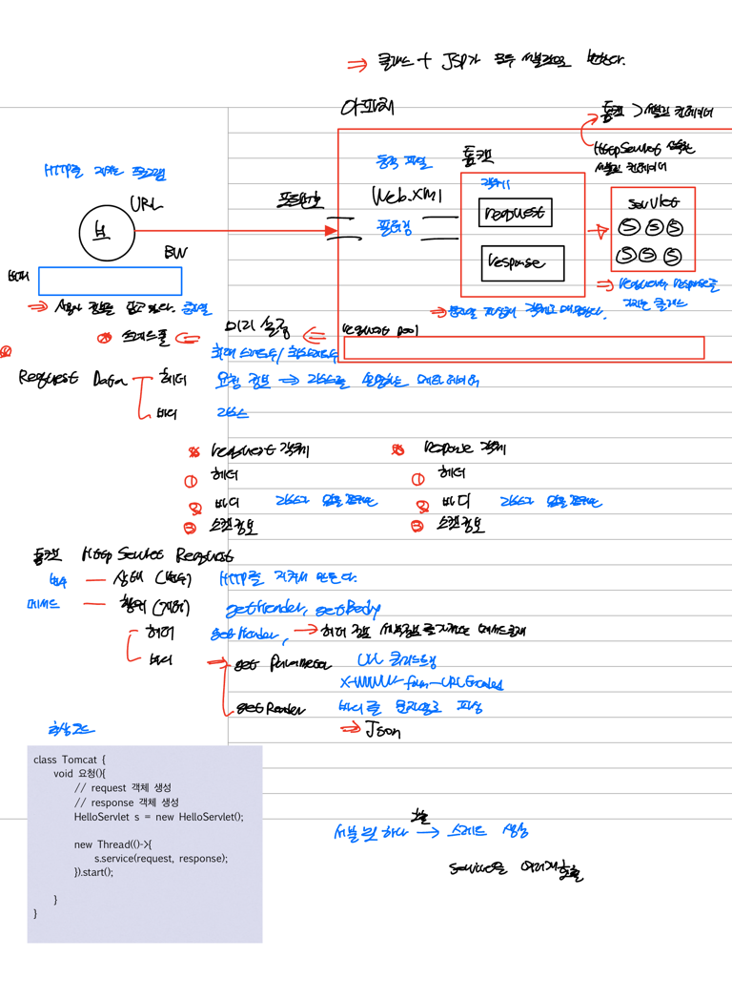
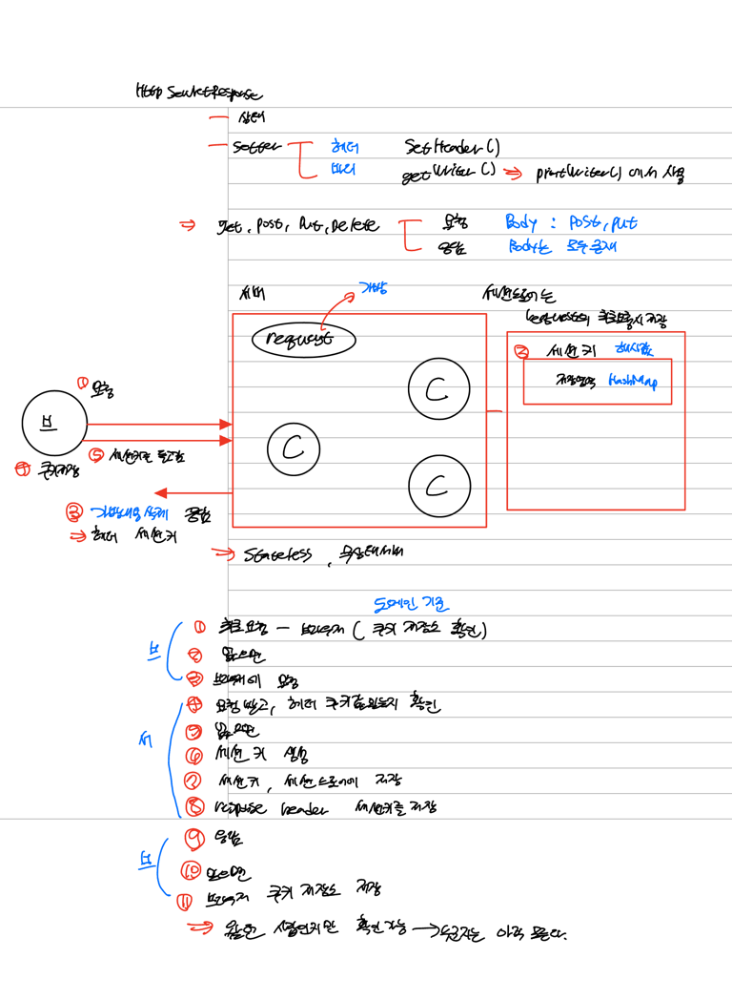

# 서블릿 기본
- 서블릿은 HTTP 요청에 대한 처리를 담당하는 자바 클래스 
- HttpServlet 클래스를 상속받아서 작성하며, HTTP 요청을 처리하기 위해 service() 메서드를 오버라이딩 한다.
- service() 메서드는 요청 방식(GET, POST 등)에 따라서 적절한 메서드(doGet(), doPost() 등)를 호출한다.
- 즉, service(), doGet(), doPost() 등의 메서드를 오버라이딩하고, 해당 메서드에서 요청 처리 로직을 구현한다. 
- 서블릿에서는 하나의 URL 요청당 하나의 클래스가 필요하지만, 스프링에서는 하나의 클래스 내에서 여러 개의 메서드를 사용해 요청을 처리할 수 있다.

```java
@WebServlet("/hello")
public class HelloServlet extends HttpServlet {

    @Override
    protected void doGet(HttpServletRequest req, HttpServletResponse resp) throws ServletException, IOException {
        PrintWriter out = resp.getWriter();
        out.println("Hello, World!");
    }
}
```

```java
@RestController
public class HelloController {

    @GetMapping("/hello")
    public String hello() {
        return "Hello, World!";
    }
}
```

- 

- http request header 살펴보기
  - HTTP 요청 헤더는 클라이언트가 서버로 요청을 보낼 때 함께 보내는 메타데이터를 담고 있다.
  - 요청 헤더는 클라이언트 측에서 전송되어 서버 측에서 해석해 요청를 처리할 때 사용한다.
  - 요청 헤더에는 쿠키, 클라이언트의 브라우저 정보, 인증 정보 등이 담겨 있다.
- http request 정보 tomcat 메서드로 살펴보기
  - 소켓을 만들면 파싱을 직접해야 하지만, 톰캣이 파싱을 하고 파싱한 데이터를 이용한다.
  - 톰캣 메서드로 파싱한 데이터에 접근한다.
  - ```java
        System.out.println("getRequestURI : " + req.getRequestURI());
        System.out.println("getContextPath : "+req.getContextPath());
        System.out.println("getMethod : "+req.getMethod());
        System.out.println("getRequestURL : "+req.getRequestURL());
        System.out.println("getQueryString : "+req.getQueryString());
        System.out.println("getParameter : "+req.getParameter("username"));
        System.out.println("getSession().getId() : "+req.getSession().getId());
        System.out.println("getCharacterEncoding : "+req.getCharacterEncoding());
        System.out.println("getContentLength : "+req.getContentLength());
        System.out.println("getContentType : "+req.getContentType());
        System.out.println("Cookie Start ==============================");
        for (Cookie cookie : req.getCookies()) {
            System.out.print(cookie.getName()+" = " + cookie.getValue());
            System.out.print(";");
        }
        System.out.println();
        System.out.println("Cookie End ==============================");
        System.out.println("getProtocol : "+req.getProtocol());
        System.out.println("getServerPort : "+req.getServerPort());
        System.out.println("getLocalAddr(서버 IP) : "+req.getLocalAddr());
        System.out.println("getLocalName(서버 이름) : "+req.getLocalName());
        System.out.println("getRemoteAddr(요청자 IP) : "+req.getRemoteAddr());
        System.out.println("getRemoteUser(요청자 이름) : "+req.getRemoteUser());
        System.out.println("getRemotePort(요청자 포트) : "+req.getRemotePort());
        System.out.println("getLocale(클라이언트의 지역정보): "+req.getLocale());

- http request body 살펴보기
  - 톰캣이 파싱해서 버퍼에 저장한 데이터를 순차적으로 읽는다.
  - 톰캣 버퍼에 저장된 데이터가 요청의 본문이 된다.
- http response 살펴보기
  - 응답 본문이 있는 POST, PUT메서드의 경우, 응답 본문의 MIME 타입을 헤더의 CONTENT-TYPE으로 명시해준다.
  - 스프링에서는 명시하지 않을 경우 기본값이, x-www-form-urlencoded
  - resp.getWriter() 메소드를 이용해 응답 본문을 작성하는 객체를 얻는다.
  - PrintWriter는 BufferedWriter와 OutputStreamWriter의 기능을 모두 수행하는 클래스로 쉽게 버퍼에 쓸 수 있다.
  - 반대로 버퍼를 읽기 위해서 BufferedReader bufferedReader = new BufferedReader(new InputStreamReader("내용"));를 이용한다.

- ## HttpServletRequest 
  - 아파치 웹서버를 통해 클라이언트의 필터링을 통과한 요청 중 정적 자원의 경우, 자원을 응답한다.
  - 아파치 웹서버를 통해 클라이언트의 필터링을 통과한 요청 중 동적 자원의 경우, 톰캣이 처리한다.
    - 톰캣이 문자열을 파싱해 객체로 매핑하고, 서블릿이 톰캣이 매핑한 객체를 사용한다. (HttpServletRequest) 
    - 톰캣이 처리하는 동적 자원 요청 : JSP, Servlet, EL, RESTful, JSTL
    - 하나의 서블릿 호출 당 하나의 스레드를 생성한다.
- ## HttpServletResponse 
  - 상태 코드와 setter를 이용해 작성한 응답 데이터 (헤더, 바디)로 이루어져 있다.
  - 요청의 경우 본문이 POST, PUT 요청일 때만 존재하지만, 응답의 경우 모두 본문이 존재한다.
  - 세션 기반 인증 방식 : 세션을 이용해 클라이언트의 상태를 서버의 세션 저장소에 저장해 이전에 요청한 적이 있는 클라이언트인지 인지할 수 있다.